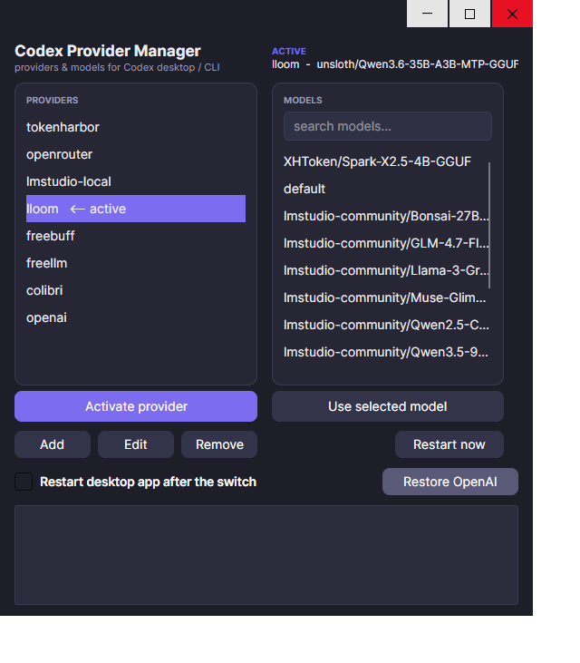

# Codex Provider Manager

Cross-platform desktop app (Avalonia, C#/.NET 8) to manage **custom model
providers** for the Codex desktop app and CLI: switch the active provider,
pick models, add/edit/remove providers — on **Windows, macOS and Linux**.



## Features

- **Providers list** with active-provider marker; one-click switch
- **Model catalog** per provider (live catalog via bridge providers, static
  map fallback), with search filter
- **Add / Edit / Remove** providers — writes a *managed block* into
  `~/.codex/config.toml` (idempotent BEGIN/END markers, rolling backup)
- **API key handling**: paste a key in the form → stored as a user env var;
  the generated `[auth]` block reads it **at request time** from the registry
  (Windows) or `~/.codex/provider-keys.env` (macOS/Linux) — immune to stale
  process environments
- **Restore OpenAI** button: removes all overrides and restarts the app —
  back to the built-in OpenAI account in one click
- **Restart desktop app** after switching (optional, persisted)
- Integrated **CLI** (same binary): `CodexProvider list|set|models|add|remove|restart`
- Dark theme, title-bar aware, resizable layout

## How it works

`~/.codex/config.toml` is the single source of truth. The app parses the
`[model_providers.*]` sections, shows them, and rewrites the active
`model_provider` / `model` lines. Each provider written by the app is wrapped
in managed markers so updates/removals never touch anything else:

```toml
# BEGIN codex-provider-manager: freellm
[model_providers.freellm]
name = "Free LLM Api"
base_url = "http://localhost:3001/v1"
wire_api = "responses"

[model_providers.freellm.auth]
command = "powershell"
args = ["-NoProfile", "-Command", "(Get-ItemProperty HKCU:\\Environment).'FREELLM_API_KEY'"]
# END codex-provider-manager: freellm
```

Providers whose upstream lacks the Responses API (LM Studio, Ollama, colibri)
work through [colibri-bridge](https://github.com/su8z3r0/colibri-bridge),
which translates `POST /v1/responses` to chat completions and hydrates the
model picker.

## Build

Requires .NET 8 SDK.

```bash
dotnet build CodexProvider.sln -c Release
# single-file executables (per-OS):
dotnet publish CodexProvider.UI -c Release -r win-x64 --self-contained true \
  -p:PublishSingleFile=true -o publish
# (osx-x64 / osx-arm64 / linux-x64 analogously)
```

## Usage

GUI: run `CodexProvider` (or `dotnet run --project CodexProvider.UI`).

CLI:

```bash
CodexProvider list                 # providers + active
CodexProvider set <id> [model]     # switch provider/model
CodexProvider models <id> [filter] # model catalog
CodexProvider add <id> <url> [envKey] [model]
CodexProvider remove <id>
CodexProvider restart              # restart the Codex desktop app
```

After any switch: **fully restart the Codex app and open a new chat** (a
thread stays anchored to the model it was born on). The *Restore OpenAI*
button does reset + restart in one click.

## Layout

```
CodexProvider.sln
├── CodexProvider.Core/      # portable logic: TOML, settings, per-OS hooks
│   ├── CodexConfig.cs       # parse/switch/add/update/remove, settings, models map
│   ├── WindowsHooks.cs      # HKCU registry keys, desktop app restart
│   └── UnixHooks.cs         # ~/.codex/provider-keys.env, osascript (macOS)
└── CodexProvider.UI/        # Avalonia UI + integrated CLI
    ├── MainWindow.axaml     # dark theme, cards, search, log
    ├── AddProviderForm.*    # add/edit dialog with API key paste
    └── Program.cs           # GUI or CLI by args
```

Per-OS differences are isolated in `IPlatformHooks` implementations:
credentials (registry vs file) and desktop-app restart (taskkill vs osascript).

## License

MIT